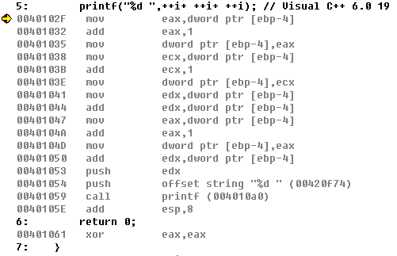
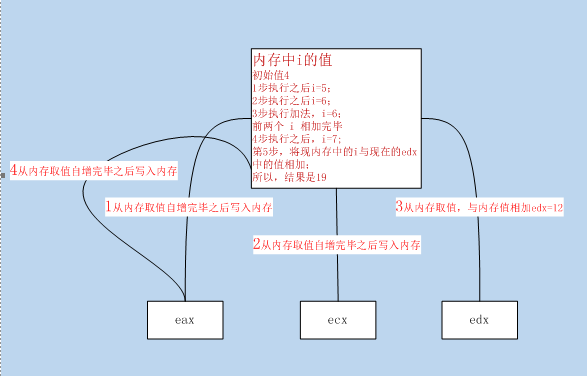
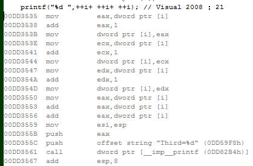
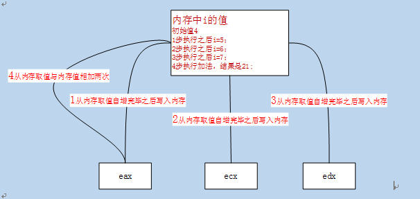


# 分辨++i  与 i++的 区别  

只有遇到 = 才有区别

```
1.i++是先执行完整个表达式之后，才会自增，++i先自增然后才会执行整个表达式；
2.如果一个表达式有出现两次以上的某变量的前置自增，这类题目与编译器有很大关系，Visual C++ 6.0 跟Visual 2008 的处理方式就不同。

```

```cpp
#include <stdio.h>
int main()
{
	int i = 4;
	printf("%d ",++i+ ++i+ ++i); // Visual C++ 6.0： 6+6+7=19  Visual 2008：7+7+7=21
	return 0;
}

```

in Visual C++ 6.0

asm:





in Visual Studio 2008

asm:




