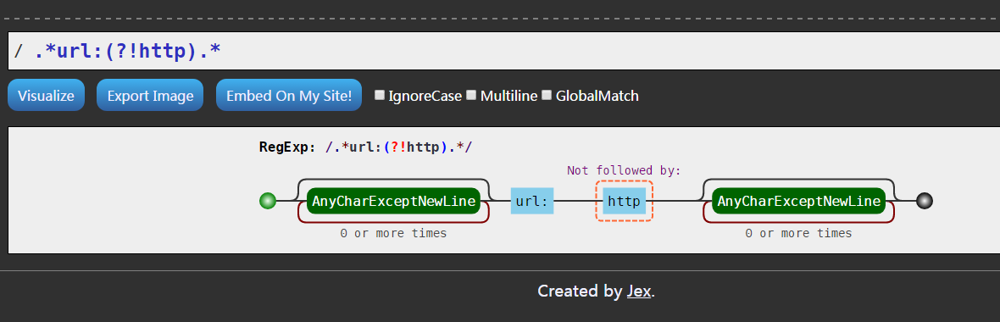
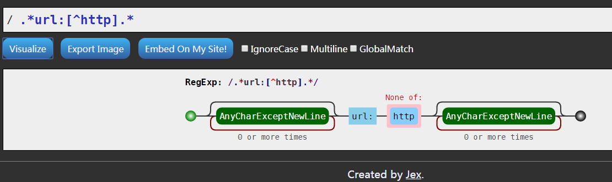


## regex 匹配任务

```
在一组列表中，找不符合提供字符串的句子。

提供句子：
url:http://tjdown.8wr.cn/2008120201513
url:araewfasfasdfasdf
url:xhttp://tjdown.8wr.cn/2008120201513
url:ttp://tjdown.8wr.cn/2008120201513

找不是 url:http 的句子。
```

### 正确 regex `.*url:(?!http).*`



匹配结果：
```
url:araewfasfasdfasdf
url:xhttp://tjdown.8wr.cn/2008120201513
url:ttp://tjdown.8wr.cn/2008120201513
```

### 一种错误写法 `.*url:[^http].*`



匹配结果:
```
url:araewfasfasdfasdf
url:xhttp://tjdown.8wr.cn/2008120201513
```
